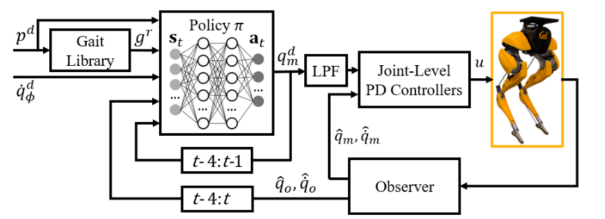
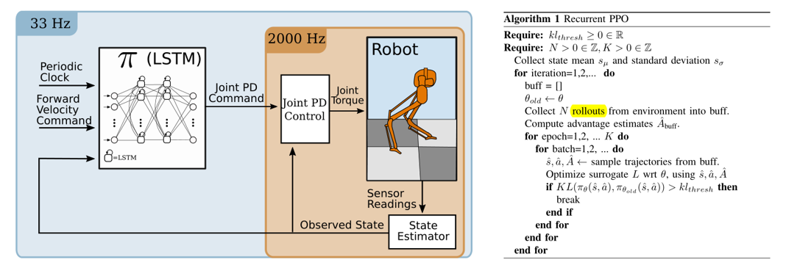
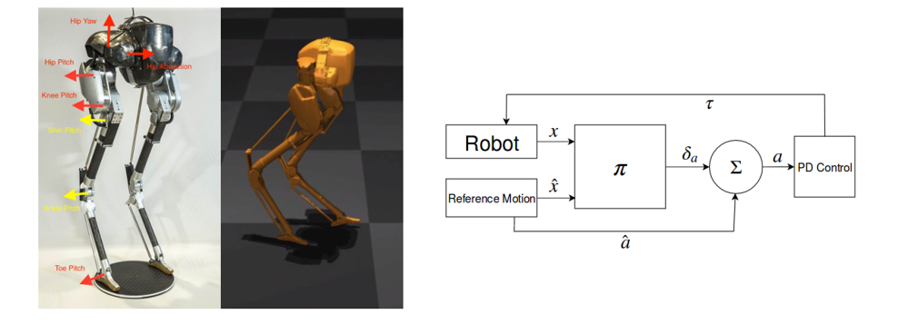
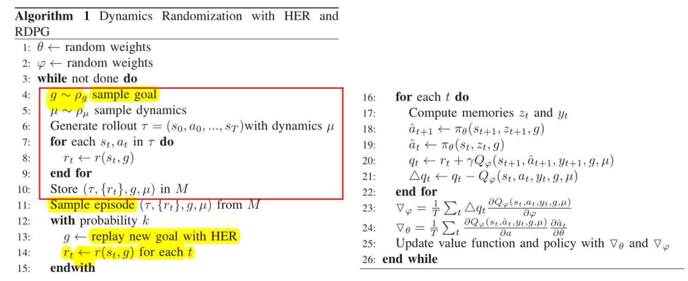

# awesome-legged-locomotion-learning 

A curated list of resources relevant to legged locomotion learning of robotics.

I'm new to the region of legged locomotion, and this awesome list is mainly used to organize and share some source I've seen. This list will be updated gradually.

## Related awesome-lists

- **[awesome-isaac-gym](https://github.com/wangcongrobot/awesome-isaac-gym)**
- [Hybrid Robotics Publications](https://hybrid-robotics.berkeley.edu/publications/)
- [Reinforcement-Learning-in-Robotics](https://github.com/Skylark0924/Reinforcement-Learning-in-Robotics)
- [bipedal-robot-learning-collection](https://github.com/zita-ch/bipedal-robot-learning-collection)
- [Awesome_Quadrupedal_Robots](https://github.com/curieuxjy/Awesome_Quadrupedal_Robots)

## Robot models

### Bipeds

| Name | Maker | Formats | License | Meshes | Inertias | Collisions |
|------|-------|---------|---------|--------|----------|------------|
| Bolt | ODRI | [URDF](https://github.com/Gepetto/example-robot-data/tree/master/robots/bolt_description) | BSD-3-Clause | ✔️ | ✔️ | ✔️ |
| Cassie (MJCF) | Agility Robotics | [MJCF](https://github.com/deepmind/mujoco_menagerie/tree/main/agility_cassie) | MIT | ✔️ | ✔️ | ✔️ |
| Cassie (URDF) | Agility Robotics | [URDF](https://github.com/robot-descriptions/cassie_description) | MIT | ✔️ | ✔️ | ✔️ |
| Spryped | Benjamin Bokser | [URDF](https://github.com/bbokser/spryped/tree/master/spryped_urdf_rev06) | GPL-3.0 | ✔️ | ✔️ | ✔️ |
| Upkie | Tast's Robots | [URDF](https://github.com/tasts-robots/upkie_description) | Apache-2.0 | ✔️ | ✔️ | ✔️ |

### Humanoids

| Name | Maker | Formats | License | Meshes | Inertias | Collisions |
|------|-------|---------|---------|--------|----------|------------|
| Atlas DRC (v3) | Boston Dynamics | [URDF](https://github.com/RobotLocomotion/drake/tree/master/examples/atlas) | BSD-3-Clause | ✔️ | ✔️ | ✔️ |
| Atlas v4 | Boston Dynamics | [URDF](https://github.com/openai/roboschool/tree/1.0.49/roboschool/models_robot/atlas_description) | MIT | ✔️ | ✔️ | ✔️ |
| Digit | Agility Robotics | [URDF](https://github.com/adubredu/DigitRobot.jl) | ✖️ | ✔️ | ✔️ | ✔️ |
| iCub | IIT | [URDF](https://github.com/robotology/icub-models/tree/master/iCub) | CC-BY-SA-4.0 | ✔️ | ✔️ | ✔️ |
| JAXON | JSK | [COLLADA](https://github.com/stephane-caron/openrave_models/tree/master/JAXON), [URDF](https://github.com/robot-descriptions/jaxon_description), [VRML](https://github.com/start-jsk/rtmros_choreonoid/tree/master/jvrc_models/JAXON_JVRC) | CC-BY-SA-4.0 | ✔️ | ✔️ | ✔️ |
| JVRC-1 | AIST | [MJCF](https://github.com/isri-aist/jvrc_mj_description/), [URDF](https://github.com/stephane-caron/jvrc_description) | BSD-2-Clause | ✔️ | ✔️ | ✔️ |
| NAO | SoftBank Robotics | [URDF](https://github.com/ros-naoqi/nao_robot/tree/master/nao_description/urdf/naoV50_generated_urdf), [Xacro](https://github.com/ros-naoqi/nao_robot/tree/master/nao_description/) | BSD-3-Clause | [:heavy_minus_sign:](https://github.com/ros-naoqi/nao_meshes#readme) | ✔️ | ✔️ |
| Robonaut 2 | NASA JSC Robotics | [URDF](https://github.com/gkjohnson/nasa-urdf-robots/tree/master/r2_description) | NASA-1.3 | ✔️ | ✔️ | ✔️ |
| Romeo | Aldebaran Robotics | [URDF](https://github.com/ros-aldebaran/romeo_robot/tree/master/romeo_description) | BSD-3-Clause | ✔️ | ✔️ | ✔️ |
| SigmaBan | Rhoban | [URDF](https://github.com/Rhoban/sigmaban_urdf) | MIT | ✔️ | ✔️ | ✔️ |
| TALOS | PAL Robotics | [URDF](https://github.com/stack-of-tasks/talos-data) | LGPL-3.0 | ✔️ | ✔️ | ✔️ |
| Valkyrie | NASA JSC Robotics | [URDF](https://github.com/gkjohnson/nasa-urdf-robots/tree/master/val_description/model), [Xacro](https://gitlab.com/nasa-jsc-robotics/val_description) | NASA-1.3 | ✔️ | ✔️ | ✔️ |
| WALK-MAN | IIT | [Xacro](https://github.com/ADVRHumanoids/iit-walkman-ros-pkg/tree/master/walkman_urdf) | BSD-3-Clause | ✔️ | ✔️ | ✔️ |

### Quadrupeds

| Name | Maker | Formats | License | Meshes | Inertias | Collisions |
|------|-------|---------|---------|--------|----------|------------|
| A1 | UNITREE Robotics | [MJCF](https://github.com/unitreerobotics/unitree_mujoco/tree/main/data/a1/xml), [URDF](https://github.com/unitreerobotics/unitree_ros/tree/master/robots/a1_description) | MPL-2.0 | ✔️ | ✔️ | ✔️ |
| Aliengo | UNITREE Robotics | [MJCF](https://github.com/unitreerobotics/unitree_mujoco/tree/main/data/aliengo/xml), [URDF](https://github.com/unitreerobotics/unitree_ros/tree/master/robots/aliengo_description) | MPL-2.0 | ✔️ | ✔️ | ✔️ |
| ANYmal B | ANYbotics | [MJCF](https://github.com/deepmind/mujoco_menagerie/tree/main/anybotics_anymal_b), [URDF](https://github.com/ANYbotics/anymal_b_simple_description) | BSD-3-Clause | ✔️ | ✔️ | ✔️ |
| ANYmal C | ANYbotics | [MJCF](https://github.com/deepmind/mujoco_menagerie/tree/main/anybotics_anymal_c), [URDF](https://github.com/ANYbotics/anymal_c_simple_description) | BSD-3-Clause | ✔️ | ✔️ | ✔️ |
| Go1 | UNITREE Robotics | [MJCF](https://github.com/unitreerobotics/unitree_mujoco/tree/main/data/go1/xml), [URDF](https://github.com/unitreerobotics/unitree_mujoco/tree/main/data/go1/urdf) | BSD-3-Clause | ✔️ | ✔️ | ✔️ |
| HyQ | IIT | [URDF](https://github.com/Gepetto/example-robot-data/tree/master/robots/hyq_description) | Apache-2.0 | ✔️ | ✔️ | ✔️ |
| Laikago | UNITREE Robotics | [MJCF](https://github.com/unitreerobotics/unitree_mujoco/tree/main/data/laikago/xml), [URDF](https://github.com/unitreerobotics/unitree_ros/tree/master/robots/laikago_description) | MPL-2.0 | ✔️ | ✔️ | ✔️ |
| Mini Cheetah | MIT | [URDF](https://github.com/Derek-TH-Wang/mini_cheetah_urdf) | BSD | ✔️ | ✔️ | ✔️ |
| Minitaur | Ghost Robotics | [URDF](https://github.com/bulletphysics/bullet3/blob/master/data/quadruped/minitaur.urdf) | BSD-2-Clause | ✔️ | ✔️ | ✔️ |
| Solo | ODRI | [URDF](https://github.com/Gepetto/example-robot-data/tree/master/robots/solo_description) | BSD-3-Clause | ✔️ | ✔️ | ✔️ |
| Spot | Boston Dynamics | [Xacro](https://github.com/clearpathrobotics/spot_ros/tree/master/spot_description) | ✖️ | ✔️ | ✖️ | ✔️ |

## Code

[[**legged_gym**](https://github.com/leggedrobotics/legged_gym)]: Isaac Gym Environments for Legged Robots 

[[**domain-randomizer**](https://github.com/montrealrobotics/domain-randomizer)]: A standalone library to randomize various OpenAI Gym Environments 

[[**cassie-mujoco-sim**](https://github.com/osudrl/cassie-mujoco-sim)]: A simulation library for Agility Robotics' Cassie robot using MuJoCo （provide the cassie's model file） 

[[**gym-cassie-run**](https://github.com/perrin-isir/gym-cassie-run)]: gym RL environment in which a mujoco simulation of Agility Robotics' Cassie robot is rewarded for walking/running forward as fast as possible. 

[[DRLoco](https://github.com/rgalljamov/DRLoco)]: Simple-to-use-and-extend implementation of the **DeepMimic** Approach using the **MuJoCo** Physics Engine and **Stable Baselines 3**, mainly for locomotion tasks [[Doc](https://drloco.readthedocs.io/en/latest/)] 

[[dm_control](https://github.com/deepmind/dm_control)]: DeepMind's software stack for physics-based simulation and Reinforcement Learning environments, using MuJoCo. 

[[**bipedal-skills**](https://github.com/facebookresearch/bipedal-skills)]: Bipedal Skills Benchmark for Reinforcement Learning 

[[terrain_benchmark](https://github.com/zita-ch/terrain_benchmark)]: terrain-robustness benchmark for legged locomotion 

[[spot_mini_mini](https://github.com/OpenQuadruped/spot_mini_mini)]: Dynamics and Domain Randomized Gait Modulation with Bezier Curves for Sim-to-Real Legged Locomotion. (ROS + Gazebo + Gym + Pybullet) [[Doc](https://spot-mini-mini.readthedocs.io/en/latest/index.html)]

[[apex](https://github.com/osudrl/apex)]: Apex is a small, modular library that contains some implementations of continuous reinforcement learning algorithms. Fully compatible with OpenAI gym. 

[[EAGERx](https://github.com/araffin/tools-for-robotic-rl-icra2022)]: Tutorial: Tools for Robotic Reinforcement Learning, Hands-on RL for Robotics with EAGER and Stable-Baselines3. 

[[FRobs_RL](https://github.com/jmfajardod/frobs_rl)\]: Framework to easily develop robotics Reinforcement Learning tasks using Gazebo and stable-baselines-3. 

## Survey

- A Survey of Sim-to-Real Transfer Techniques Applied to Reinforcement Learning for Bioinspired Robots. (TNNLS, 2021) [**sim2real**] [[paper](https://ieeexplore.ieee.org/abstract/document/9552429)] 
- Robot Learning From Randomized Simulations: A Review. (Frontiers in Robotics and AI, 2022) [**sim2real**] [[paper](https://www.ncbi.nlm.nih.gov/pmc/articles/PMC9038844/pdf/frobt-09-799893.pdf)]
- Sim-to-Real Transfer in Deep Reinforcement Learning for Robotics: a Survey. (IEEE SSCI, 2020) [**sim2real**] [[paper](https://ieeexplore.ieee.org/stamp/stamp.jsp?tp=&arnumber=9308468)]
- 
How to train your robot with deep reinforcement learning: lessons we have learned. (IJRR, 2021) [**RL Discussion**] [[paper](https://journals.sagepub.com/doi/pdf/10.1177/0278364920987859)] 

## Technical blog

- [强化学习环境ISAAC GYM初步入门](https://mp.weixin.qq.com/s?__biz=MzkyNDI5OTA1OA==&mid=2247495740&idx=1&sn=4d06d5ccf9ad9c8a9311bec613833bfd&chksm=c1d54a61f6a2c377769baf47c2fbffd098f091fba392f15802f68ccadb00d94991dcd4d282f4&token=817725460&lang=zh_CN#rd)
- [技术总结《OpenAI Gym》](https://www.meltycriss.com/2018/03/26/tech-gym/)

## Papers

#### Arxiv Preprint

- [2022] NeRF2Real: Sim2real Transfer of Vision-guided Bipedal Motion Skills using Neural Radiance Fields. [[paper](https://arxiv.org/pdf/2210.04932.pdf)]
- [2022] Learning Bipedal Walking On Planned Footsteps For Humanoid Robots. [[paper](https://arxiv.org/pdf/2207.12644.pdf)] [[code](https://github.com/rohanpsingh/LearningHumanoidWalking)]
- [2022] Walking in Narrow Spaces: Safety-critical Locomotion Control for Quadrupedal Robots with Duality-based Optimization. [[paper](https://arxiv.org/pdf/2212.14199.pdf)] [[code](https://github.com/HybridRobotics/quadruped_nmpc_dcbf_duality)]
- [2022] Bridging Model-based Safety and Model-free Reinforcement Learning through System Identification of Low Dimensional Linear Models. [[paper](https://arxiv.org/pdf/2205.05787.pdf)]
- [2022] Dynamic Bipedal Maneuvers through Sim-to-Real Reinforcement Learning. [[paper](https://arxiv.org/abs/2207.07835)]

### 2023

#### Conference

- [**ICRA**] Generating a Terrain-Robustness Benchmark for Legged Locomotion: A Prototype via Terrain Authoring and Active Learning [[paper](https://arxiv.org/pdf/2208.07681.pdf)] [[code](https://github.com/zita-ch/terrain_benchmark)]

#### Journal

### 2022

#### Conference

- [**PMLR**] Towards Real Robot Learning in the Wild: A Case Study in Bipedal Locomotion. [[paper](https://proceedings.mlr.press/v164/bloesch22a/bloesch22a.pdf)]
- [**PMLR**] Learning to Walk in Minutes Using Massively Parallel Deep Reinforcement Learning. [**platform**] [[paper](https://proceedings.mlr.press/v164/rudin22a/rudin22a.pdf)] [[code](https://github.com/leggedrobotics/legged_gym)]
- [**CoRL**] Walk These Ways: Tuning Robot Control for Generalization with Multiplicity of Behavior. (Oral) [**control**] [[paper](https://arxiv.org/abs/2212.03238)] [[code](https://github.com/Improbable-AI/walk-these-ways)]
- [**RSS**] Rapid Locomotion via Reinforcement Learning. [[paper](https://github.com/Improbable-AI/rapid-locomotion-rl)] [[code](https://github.com/Improbable-AI/rapid-locomotion-rl)]
- [**ICRA**] An Adaptable Approach to Learn Realistic Legged Locomotion without Examples. [[paper](https://ieeexplore.ieee.org/abstract/document/9812441)]
- [**ICRA**] Sim-to-Real Learning for Bipedal Locomotion Under Unsensed Dynamic Loads. [[paper](https://ieeexplore.ieee.org/document/9811783)]
- [**ACM GRAPH**] ASE: Large-Scale Reusable Adversarial Skill Embeddings for Physically Simulated Characters [[paper](https://dl.acm.org/doi/pdf/10.1145/3528223.3530110)]

#### Journal

- [**IEEE-RAS**] Improving Sample Efficiency of Deep Reinforcement Learning for Bipedal Walking. [[paper](https://ieeexplore.ieee.org/document/10000068)] [[code](https://github.com/rgalljamov/learn2walk)] 
- [**IEEE-RAS**] Dynamic Bipedal Turning through Sim-to-Real Reinforcement Learning. [[paper](https://ieeexplore.ieee.org/abstract/document/10000225)]
- [**TCAS-II**] Parallel Deep Reinforcement Learning Method for Gait Control of Biped Robot .[[paper](https://ieeexplore.ieee.org/document/9690599)]

### 2021

#### Conference

- [**ICRA**] Reinforcement Learning for Robust Parameterized Locomotion Control of Bipedal Robots. [**sim2real**] [[paper](https://ieeexplore.ieee.org/abstract/document/9560769)]

- [**NeurIPS**] Hierarchical Skills for Efficient Exploration [**control**] [[paper](https://arxiv.org/pdf/2110.10809.pdf)]

#### Journal

### 2020

#### Conference

- [**RSS**] Learning Memory-Based Control for Human-Scale Bipedal Locomotion. [**sim2real**] [[paper](https://arxiv.org/abs/2006.02402)] 

- [**IROS**] Crossing the Gap: A Deep Dive into Zero-Shot Sim-to-Real Transfer for Dynamics. [**sim2real**] [[paper](https://ieeexplore.ieee.org/stamp/stamp.jsp?tp=&arnumber=9341617)] [[code](https://github.com/eugval/sim2real_dynamics_simulation)]
- [**PMLR**] CoMic: Complementary Task Learning & Mimicry for Reusable Skills. [**imimtation**] [[paper](https://proceedings.mlr.press/v119/hasenclever20a.html)] [[code](https://github.com/deepmind/dm_control/tree/main/dm_control/locomotion)]

#### Journal

### 2019

#### Conference

- [**IROS**] Sim-to-Real Transfer for Biped Locomotion. [[paper](https://ieeexplore.ieee.org/abstract/document/8968053)]

#### Journal

### 2018

#### Conference

- [**IROS**] Feedback Control For Cassie With Deep Reinforcement Learning. [**control**] [[paper](https://ieeexplore.ieee.org/abstract/document/8593722)] [[code](https://github.com/osudrl/cassie-mujoco-sim)] 

- [**ICRA**] Sim-to-Real Transfer of Robotic Control with Dynamics Randomization. [**sim2real**] [[paper](https://ieeexplore.ieee.org/abstract/document/8460528)] 

- [**RSS**] Sim-to-Real: Learning Agile Locomotion For Quadruped Robots. [**sim2real**] [[paper](http://www.roboticsproceedings.org/rss14/p10.pdf)]
- [**ACM SIGGRAPH**] DeepMimic: Example-Guided Deep Reinforcement Learning of Physics-Based Character Skills [[paper](https://xbpeng.github.io/projects/DeepMimic/2018_TOG_DeepMimic.pdf)] [[code](https://github.com/xbpeng/DeepMimic)]

#### Journal

### 2017

#### Conference

- [**ACM SIGGRAPH**] Learning locomotion skills using deeprl: Does the choice of action space matter? [**control**] [[paper](https://xbpeng.github.io/projects/ActionSpace/index.html)] 

#### Journal
