# awesome-legged-locomotion-learning 

A curated list of resources relevant to legged locomotion learning of robotics.

I'm new to the region of legged locomotion, and this awesome list is mainly used to organize and share some source I've seen. This list will be updated gradually.

## Related awesome-lists

- **[awesome-isaac-gym](https://github.com/wangcongrobot/awesome-isaac-gym)**
- [Hybrid Robotics Publications](https://hybrid-robotics.berkeley.edu/publications/)
- [Reinforcement-Learning-in-Robotics](https://github.com/Skylark0924/Reinforcement-Learning-in-Robotics)
- [bipedal-robot-learning-collection](https://github.com/zita-ch/bipedal-robot-learning-collection)
- [Awesome_Quadrupedal_Robots](https://github.com/curieuxjy/Awesome_Quadrupedal_Robots)
- [Awesome-Implicit-NeRF-Robotics](https://github.com/zubair-irshad/Awesome-Implicit-NeRF-Robotics)
- [Legged-Robots](https://github.com/singhaman1750/Legged-Robots)
- [Awesome Robot Descriptions](https://github.com/robot-descriptions/awesome-robot-descriptions)

## Robot models

### Bipeds

| Name | Maker | Formats | License | Meshes | Inertias | Collisions |
|------|-------|---------|---------|--------|----------|------------|
| Bolt | ODRI | [URDF](https://github.com/Gepetto/example-robot-data/tree/master/robots/bolt_description) | BSD-3-Clause | ✔️ | ✔️ | ✔️ |
| Cassie (MJCF) | Agility Robotics | [MJCF](https://github.com/deepmind/mujoco_menagerie/tree/main/agility_cassie) | MIT | ✔️ | ✔️ | ✔️ |
| Cassie (URDF) | Agility Robotics | [URDF](https://github.com/robot-descriptions/cassie_description) | MIT | ✔️ | ✔️ | ✔️ |
| Spryped | Benjamin Bokser | [URDF](https://github.com/bbokser/spryped/tree/master/spryped_urdf_rev06) | GPL-3.0 | ✔️ | ✔️ | ✔️ |
| Upkie | Tast's Robots | [URDF](https://github.com/tasts-robots/upkie_description) | Apache-2.0 | ✔️ | ✔️ | ✔️ |

### Humanoids

| Name | Maker | Formats | License | Meshes | Inertias | Collisions |
|------|-------|---------|---------|--------|----------|------------|
| Atlas DRC (v3) | Boston Dynamics | [URDF](https://github.com/RobotLocomotion/drake/tree/master/examples/atlas) | BSD-3-Clause | ✔️ | ✔️ | ✔️ |
| Atlas v4 | Boston Dynamics | [URDF](https://github.com/openai/roboschool/tree/1.0.49/roboschool/models_robot/atlas_description) | MIT | ✔️ | ✔️ | ✔️ |
| Digit | Agility Robotics | [URDF](https://github.com/adubredu/DigitRobot.jl) | ✖️ | ✔️ | ✔️ | ✔️ |
| iCub | IIT | [URDF](https://github.com/robotology/icub-models/tree/master/iCub) | CC-BY-SA-4.0 | ✔️ | ✔️ | ✔️ |
| JAXON | JSK | [COLLADA](https://github.com/stephane-caron/openrave_models/tree/master/JAXON), [URDF](https://github.com/robot-descriptions/jaxon_description), [VRML](https://github.com/start-jsk/rtmros_choreonoid/tree/master/jvrc_models/JAXON_JVRC) | CC-BY-SA-4.0 | ✔️ | ✔️ | ✔️ |
| JVRC-1 | AIST | [MJCF](https://github.com/isri-aist/jvrc_mj_description/), [URDF](https://github.com/stephane-caron/jvrc_description) | BSD-2-Clause | ✔️ | ✔️ | ✔️ |
| NAO | SoftBank Robotics | [URDF](https://github.com/ros-naoqi/nao_robot/tree/master/nao_description/urdf/naoV50_generated_urdf), [Xacro](https://github.com/ros-naoqi/nao_robot/tree/master/nao_description/) | BSD-3-Clause | [:heavy_minus_sign:](https://github.com/ros-naoqi/nao_meshes#readme) | ✔️ | ✔️ |
| Robonaut 2 | NASA JSC Robotics | [URDF](https://github.com/gkjohnson/nasa-urdf-robots/tree/master/r2_description) | NASA-1.3 | ✔️ | ✔️ | ✔️ |
| Romeo | Aldebaran Robotics | [URDF](https://github.com/ros-aldebaran/romeo_robot/tree/master/romeo_description) | BSD-3-Clause | ✔️ | ✔️ | ✔️ |
| SigmaBan | Rhoban | [URDF](https://github.com/Rhoban/sigmaban_urdf) | MIT | ✔️ | ✔️ | ✔️ |
| TALOS | PAL Robotics | [URDF](https://github.com/stack-of-tasks/talos-data) | LGPL-3.0 | ✔️ | ✔️ | ✔️ |
| Valkyrie | NASA JSC Robotics | [URDF](https://github.com/gkjohnson/nasa-urdf-robots/tree/master/val_description/model), [Xacro](https://gitlab.com/nasa-jsc-robotics/val_description) | NASA-1.3 | ✔️ | ✔️ | ✔️ |
| WALK-MAN | IIT | [Xacro](https://github.com/ADVRHumanoids/iit-walkman-ros-pkg/tree/master/walkman_urdf) | BSD-3-Clause | ✔️ | ✔️ | ✔️ |

### Quadrupeds

| Name | Maker | Formats | License | Meshes | Inertias | Collisions |
|------|-------|---------|---------|--------|----------|------------|
| A1 | UNITREE Robotics | [MJCF](https://github.com/unitreerobotics/unitree_mujoco/tree/main/data/a1/xml), [URDF](https://github.com/unitreerobotics/unitree_ros/tree/master/robots/a1_description) | MPL-2.0 | ✔️ | ✔️ | ✔️ |
| Aliengo | UNITREE Robotics | [MJCF](https://github.com/unitreerobotics/unitree_mujoco/tree/main/data/aliengo/xml), [URDF](https://github.com/unitreerobotics/unitree_ros/tree/master/robots/aliengo_description) | MPL-2.0 | ✔️ | ✔️ | ✔️ |
| ANYmal B | ANYbotics | [MJCF](https://github.com/deepmind/mujoco_menagerie/tree/main/anybotics_anymal_b), [URDF](https://github.com/ANYbotics/anymal_b_simple_description) | BSD-3-Clause | ✔️ | ✔️ | ✔️ |
| ANYmal C | ANYbotics | [MJCF](https://github.com/deepmind/mujoco_menagerie/tree/main/anybotics_anymal_c), [URDF](https://github.com/ANYbotics/anymal_c_simple_description) | BSD-3-Clause | ✔️ | ✔️ | ✔️ |
| Go1 | UNITREE Robotics | [MJCF](https://github.com/unitreerobotics/unitree_mujoco/tree/main/data/go1/xml), [URDF](https://github.com/unitreerobotics/unitree_mujoco/tree/main/data/go1/urdf) | BSD-3-Clause | ✔️ | ✔️ | ✔️ |
| HyQ | IIT | [URDF](https://github.com/Gepetto/example-robot-data/tree/master/robots/hyq_description) | Apache-2.0 | ✔️ | ✔️ | ✔️ |
| Laikago | UNITREE Robotics | [MJCF](https://github.com/unitreerobotics/unitree_mujoco/tree/main/data/laikago/xml), [URDF](https://github.com/unitreerobotics/unitree_ros/tree/master/robots/laikago_description) | MPL-2.0 | ✔️ | ✔️ | ✔️ |
| Mini Cheetah | MIT | [URDF](https://github.com/Derek-TH-Wang/mini_cheetah_urdf) | BSD | ✔️ | ✔️ | ✔️ |
| Minitaur | Ghost Robotics | [URDF](https://github.com/bulletphysics/bullet3/blob/master/data/quadruped/minitaur.urdf) | BSD-2-Clause | ✔️ | ✔️ | ✔️ |
| Solo | ODRI | [URDF](https://github.com/Gepetto/example-robot-data/tree/master/robots/solo_description) | BSD-3-Clause | ✔️ | ✔️ | ✔️ |
| Spot | Boston Dynamics | [Xacro](https://github.com/clearpathrobotics/spot_ros/tree/master/spot_description) | ✖️ | ✔️ | ✖️ | ✔️ |

## Code

[[**legged_gym**](https://github.com/leggedrobotics/legged_gym)]: Isaac Gym Environments for Legged Robots 

[[**domain-randomizer**](https://github.com/montrealrobotics/domain-randomizer)]: A standalone library to randomize various OpenAI Gym Environments 

[[**cassie-mujoco-sim**](https://github.com/osudrl/cassie-mujoco-sim)]: A simulation library for Agility Robotics' Cassie robot using MuJoCo （provide the cassie's model file） 

[[**gym-cassie-run**](https://github.com/perrin-isir/gym-cassie-run)]: gym RL environment in which a mujoco simulation of Agility Robotics' Cassie robot is rewarded for walking/running forward as fast as possible. 

[[DRLoco](https://github.com/rgalljamov/DRLoco)]: Simple-to-use-and-extend implementation of the **DeepMimic** Approach using the **MuJoCo** Physics Engine and **Stable Baselines 3**, mainly for locomotion tasks [[Doc](https://drloco.readthedocs.io/en/latest/)] 

[[dm_control](https://github.com/deepmind/dm_control)]: DeepMind's software stack for physics-based simulation and Reinforcement Learning environments, using MuJoCo. 

[[**bipedal-skills**](https://github.com/facebookresearch/bipedal-skills)]: Bipedal Skills Benchmark for Reinforcement Learning 

[[terrain_benchmark](https://github.com/zita-ch/terrain_benchmark)]: terrain-robustness benchmark for legged locomotion 

[[spot_mini_mini](https://github.com/OpenQuadruped/spot_mini_mini)]: Dynamics and Domain Randomized Gait Modulation with Bezier Curves for Sim-to-Real Legged Locomotion. (ROS + Gazebo + Gym + Pybullet) [[Doc](https://spot-mini-mini.readthedocs.io/en/latest/index.html)]

[[apex](https://github.com/osudrl/apex)]: Apex is a small, modular library that contains some implementations of continuous reinforcement learning algorithms. Fully compatible with OpenAI gym. 

[[EAGERx](https://github.com/araffin/tools-for-robotic-rl-icra2022)]: Tutorial: Tools for Robotic Reinforcement Learning, Hands-on RL for Robotics with EAGER and Stable-Baselines3. 

[[FRobs_RL](https://github.com/jmfajardod/frobs_rl)\]: Framework to easily develop robotics Reinforcement Learning tasks using Gazebo and stable-baselines-3. 

[[Cassie_FROST](https://github.com/UMich-BipedLab/Cassie_Model)]: This repository contains an example using C-FROST to generate a library of walking gaits for Cassie series robot. The code depends on [FROST](https://github.com/ayonga/frost-dev) and [C-FROST](https://github.com/UMich-BipedLab/C-Frost). 

[[GenLoco](https://github.com/HybridRobotics/GenLoco)]: Official codebase for [GenLoco: Generalized Locomotion Controllers for Quadrupedal Robots](http://arxiv.org/abs/2209.05309), containing code for training on randomized robotic morphologies to imitate reference motions as well as pre-trained policies and code to deploy these on simulated or real-world robots. 

[[rl-mpc-locomotion](https://github.com/silvery107/rl-mpc-locomotion)]: This repo is aim to provide a fast simulation and RL training framework for quadrupad locomotion. The control framework is a hierarchical controller composed of an higher-level policy network and a lower-level model predictive controller (MPC).

## Survey

- A Survey of Sim-to-Real Transfer Techniques Applied to Reinforcement Learning for Bioinspired Robots. (TNNLS, 2021) [**sim2real**] [[paper](https://ieeexplore.ieee.org/abstract/document/9552429)] 
- Robot Learning From Randomized Simulations: A Review. (Frontiers in Robotics and AI, 2022) [**sim2real**] [[paper](https://www.ncbi.nlm.nih.gov/pmc/articles/PMC9038844/pdf/frobt-09-799893.pdf)]
- Sim-to-Real Transfer in Deep Reinforcement Learning for Robotics: a Survey. (IEEE SSCI, 2020) [**sim2real**] [[paper](https://ieeexplore.ieee.org/stamp/stamp.jsp?tp=&arnumber=9308468)]
- How to train your robot with deep reinforcement learning: lessons we have learned. (IJRR, 2021) [**RL Discussion**] [[paper](https://journals.sagepub.com/doi/pdf/10.1177/0278364920987859)]
- Transformer in Reinforcement Learning for Decision-Making: A Survey. [[paper](https://www.techrxiv.org/articles/preprint/Transformer_in_Reinforcement_Learning_for_Decision-Making_A_Survey/22211908)] [[github](https://github.com/williamyuanv0/Transformer-in-Reinforcement-Learning-for-Decision-Making-A-Survey)]
- Recent Approaches for Perceptive Legged Locomotion. [[paper](https://arxiv.org/pdf/2209.10118.pdf)]

## Technical blog

- [强化学习环境ISAAC GYM初步入门](https://mp.weixin.qq.com/s?__biz=MzkyNDI5OTA1OA==&mid=2247495740&idx=1&sn=4d06d5ccf9ad9c8a9311bec613833bfd&chksm=c1d54a61f6a2c377769baf47c2fbffd098f091fba392f15802f68ccadb00d94991dcd4d282f4&token=817725460&lang=zh_CN#rd)
- [技术总结《OpenAI Gym》](https://www.meltycriss.com/2018/03/26/tech-gym/)

## Papers

#### Arxiv Preprint

- [2023] Learning Bipedal Walking for Humanoids with Current Feedback. [[paper](https://arxiv.org/pdf/2303.03724.pdf)] [[code](https://github.com/rohanpsingh/LearningHumanoidWalking/tree/topic/omnidirectional-walk)]

- [2023] DreamWaQ: Learning Robust Quadrupedal Locomotion With Implicit Terrain Imagination via Deep Reinforcement Learning. [[paper](https://arxiv.org/pdf/2301.10602.pdf)]

- [2023] Learning Humanoid Locomotion with Transformers. [[paper](https://arxiv.org/pdf/2303.03381.pdf)]

- [2023] Robust and Versatile Bipedal Jumping Control through Multi-Task Reinforcement Learning. [[paper](https://arxiv.org/pdf/2302.09450.pdf)]

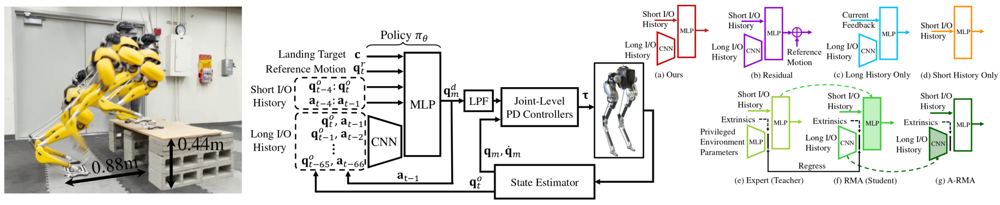

- [2022] Learning Visual Locomotion with Cross-Modal Supervision. [[paper](https://arxiv.org/pdf/2211.03785.pdf)] [code soon]

- [2022] MoCapAct: A Multi-Task Dataset for Simulated Humanoid Control. [**imitation**] [[paper](https://arxiv.org/pdf/2208.07363.pdf)] [[project](https://microsoft.github.io/MoCapAct/)]

- [2022] Imitate and Repurpose: Learning Reusable Robot Movement Skills From Human and Animal Behaviors. [**imitation**] [[paper](https://arxiv.org/abs/2203.17138)]

- [2022] NeRF2Real: Sim2real Transfer of Vision-guided Bipedal Motion Skills using Neural Radiance Fields. [[paper](https://arxiv.org/pdf/2210.04932.pdf)]

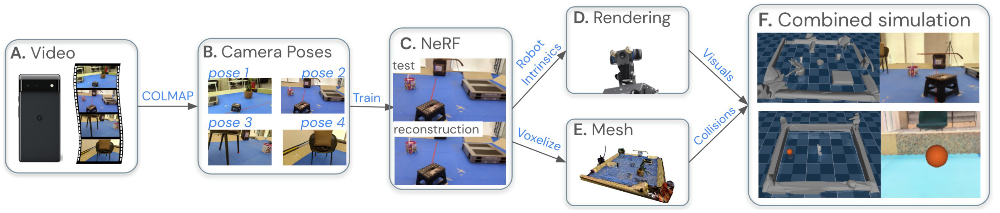

- [2022] Learning Bipedal Walking On Planned Footsteps For Humanoid Robots. [[paper](https://arxiv.org/pdf/2207.12644.pdf)] [[code](https://github.com/rohanpsingh/LearningHumanoidWalking)]

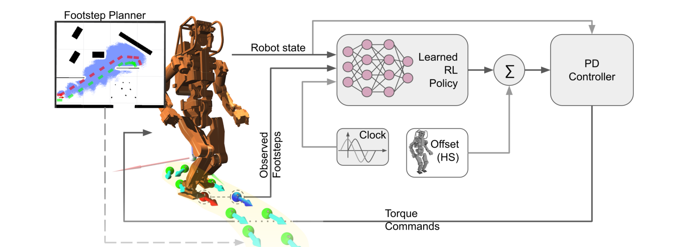

- [2022] Walking in Narrow Spaces: Safety-critical Locomotion Control for Quadrupedal Robots with Duality-based Optimization. [[paper](https://arxiv.org/pdf/2212.14199.pdf)] [[code](https://github.com/HybridRobotics/quadruped_nmpc_dcbf_duality)]
- [2022] Bridging Model-based Safety and Model-free Reinforcement Learning through System Identification of Low Dimensional Linear Models. [[paper](https://arxiv.org/pdf/2205.05787.pdf)]
- [2022] Dynamic Bipedal Maneuvers through Sim-to-Real Reinforcement Learning. [[paper](https://arxiv.org/abs/2207.07835)]
- [2022] Creating a Dynamic Quadrupedal Robotic Goalkeeper with Reinforcement Learning. [[paper](https://xbpeng.github.io/projects/A1Goalkeeping/2022_A1Goalkeeping.pdf)]
- [2022] Sim-to-Real Learning of Compliant Bipedal Locomotion on Torque Sensor-Less Gear-Driven Humanoid. [[paper](https://arxiv.org/abs/2204.03897)]

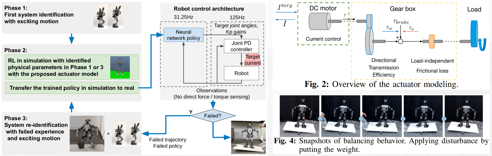

- [2021] RMA: Rapid Motor Adaptation for Legged Robots. [[paper](https://arxiv.org/pdf/2107.04034.pdf)]

### 2023

#### Conference

- [**ICRA**] ViNL: Visual Navigation and Locomotion Over Obstacles. [[paper](https://arxiv.org/abs/2210.14791)] [[code](https://github.com/SimarKareer/ViNL)] [[project page](http://www.joannetruong.com/projects/vinl.html)]
- [**ICRA**] Generating a Terrain-Robustness Benchmark for Legged Locomotion: A Prototype via Terrain Authoring and Active Learning. [[paper](https://arxiv.org/pdf/2208.07681.pdf)] [[code](https://github.com/zita-ch/terrain_benchmark)]
- [**ICRA**] Learning to Walk by Steering: Perceptive Quadrupedal Locomotion in Dynamic Environments. [**perceptive locomotion**] [[paper](https://arxiv.org/abs/2209.09233)] [[code](https://github.com/UT-Austin-RPL/PRELUDE)]

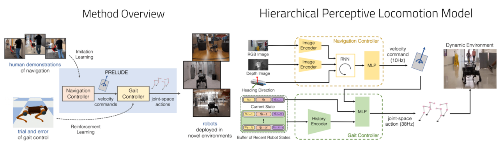

- [**ICRA**] Legs as Manipulator: Pushing Quadrupedal Agility Beyond Locomotion. [[paper](https://arxiv.org/pdf/2303.11330.pdf)]
- [**ICRA**] DribbleBot: Dynamic Legged Manipulation in the Wild. [[paper](https://arxiv.org/pdf/2304.01159.pdf)] [[code soon](https://github.com/Improbable-AI/dribblebot)]

#### Journal

### 2022

#### Conference

- [**PMLR**] Towards Real Robot Learning in the Wild: A Case Study in Bipedal Locomotion. [[paper](https://proceedings.mlr.press/v164/bloesch22a/bloesch22a.pdf)]
- [**PMLR**] Learning to Walk in Minutes Using Massively Parallel Deep Reinforcement Learning. [**platform**] [[paper](https://proceedings.mlr.press/v164/rudin22a/rudin22a.pdf)] [[code](https://github.com/leggedrobotics/legged_gym)]
- [**CoRL**] Walk These Ways: Tuning Robot Control for Generalization with Multiplicity of Behavior. (Oral) [**control**] [[paper](https://arxiv.org/abs/2212.03238)] [[code](https://github.com/Improbable-AI/walk-these-ways)]
- [**CoRL**] Deep Whole-Body Control: Learning a Unified Policy for Manipulation and Locomotion. (Oral) [[paper](https://manipulation-locomotion.github.io/resources/Deep-Whole-Body-Control.pdf)]
- [**CoRL**] Legged Locomotion in Challenging Terrains using Egocentric Vision. [[paper](https://proceedings.mlr.press/v205/agarwal23a/agarwal23a.pdf)]
- [**RSS**] Rapid Locomotion via Reinforcement Learning. [[paper](https://github.com/Improbable-AI/rapid-locomotion-rl)] [[code](https://github.com/Improbable-AI/rapid-locomotion-rl)]
- [**ICRA**] An Adaptable Approach to Learn Realistic Legged Locomotion without Examples. [[paper](https://ieeexplore.ieee.org/abstract/document/9812441)]
- [**ICRA**] Accessibility-Based Clustering for Effcient Learning of Locomotion Skills. [[paper](https://ieeexplore.ieee.org/stamp/stamp.jsp?tp=&arnumber=9812113)]
- [**ICRA**] Sim-to-Real Learning for Bipedal Locomotion Under Unsensed Dynamic Loads. [[paper](https://ieeexplore.ieee.org/document/9811783)]
- [**ICRA**] Sim-to-Real Learning of Footstep-Constrained Bipedal Dynamic Walking. [[paper](https://ieeexplore.ieee.org/stamp/stamp.jsp?arnumber=9812015)]
- [**IROS**] Vision-Guided Quadrupedal Locomotion in the Wild with Multi-Modal Delay Randomization. [**vision-guide**] [[paper](https://openreview.net/pdf?id=N3WiBWejPzw)] [[code](https://github.com/Mehooz/vision4leg)]

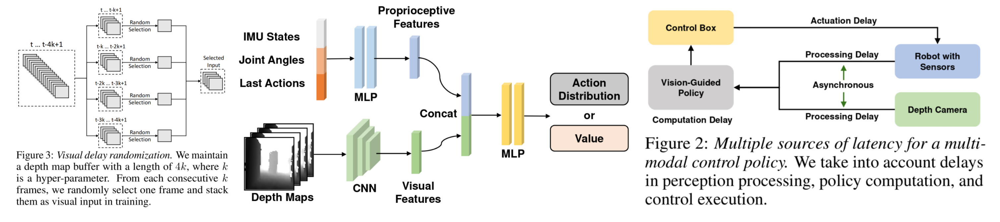

- [**ICLR**] Learning Vision-Guided Quadrupedal Locomotion End-to-End with Cross-Modal Transformers. [**vision-guide**] [[paper](https://openreview.net/pdf?id=nhnJ3oo6AB)] [[code](https://github.com/Mehooz/vision4leg)]

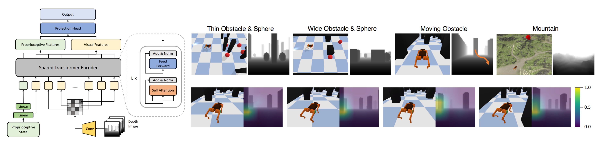

- [**CVPR**] Coupling Vision and Proprioception for Navigation of Legged Robots. [**vision-guide**] [[paper](https://openaccess.thecvf.com/content/CVPR2022/papers/Fu_Coupling_Vision_and_Proprioception_for_Navigation_of_Legged_Robots_CVPR_2022_paper.pdf)] [[code](https://github.com/MarkFzp/navigation-locomotion)]
- [**ACM GRAPH**] ASE: Large-Scale Reusable Adversarial Skill Embeddings for Physically Simulated Characters [[paper](https://dl.acm.org/doi/pdf/10.1145/3528223.3530110)]
- [**ICMA**] Custom Sine Waves Are Enough for Imitation Learning of Bipedal Gaits with Different Styles. [[paper](https://arxiv.org/abs/2204.04157)]

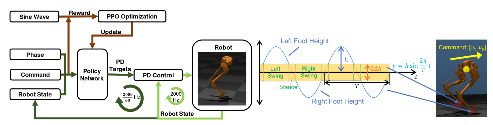

- [**Machines**] Deep Reinforcement Learning for Model Predictive Controller Based on Disturbed Single Rigid Body Model of Biped Robots. [[paper](https://www.mdpi.com/2075-1702/10/11/975)]

#### Journal

- [**IEEE-RAS**] Improving Sample Efficiency of Deep Reinforcement Learning for Bipedal Walking. [[paper](https://ieeexplore.ieee.org/document/10000068)] [[code](https://github.com/rgalljamov/learn2walk)] 
- [**IEEE-RAS**] Dynamic Bipedal Turning through Sim-to-Real Reinforcement Learning. [[paper](https://ieeexplore.ieee.org/abstract/document/10000225)]
- [**IEEE-RAS**] Learning Bipedal Walking On Planned Footsteps For Humanoid Robots. [[paper](https://arxiv.org/pdf/2207.12644.pdf)] [[code](https://github.com/rohanpsingh/learninghumanoidwalking)]
- [**TCAS-II**] Parallel Deep Reinforcement Learning Method for Gait Control of Biped Robot. [[paper](https://ieeexplore.ieee.org/document/9690599)]
- [**ScienceRobotics**] Learning robust perceptive locomotion for quadrupedal robots in the wild. [[paper](https://arxiv.org/pdf/2201.08117.pdf)]
- [**IEEE-TRO**] RLOC: Terrain-Aware Legged Locomotion Using Reinforcement Learning and Optimal Control. [[paper](https://ieeexplore.ieee.org/document/9779429)] [[code](https://github.com/ori-drs/rloc_manuscript_supplementary_code)]

### 2021

#### Conference

- [**ICRA**] Reinforcement Learning for Robust Parameterized Locomotion Control of Bipedal Robots. [**sim2real**] [[paper](https://ieeexplore.ieee.org/abstract/document/9560769)]

- [**NeurIPS**] Hierarchical Skills for Efficient Exploration. [**control**] [[paper](https://arxiv.org/pdf/2110.10809.pdf)]
- [**ICRA**] Sim-to-Real Learning of All Common Bipedal Gaits via Periodic Reward Composition. [[paper](https://arxiv.org/abs/2011.01387)]
- [**ICRA**] Deepwalk: Omnidirectional bipedal gait by deep reinforcement learning. [[paper](https://www.ais.uni-bonn.de/papers/ICRA_2021_Rodriguez.pdf)]
- [**IROS**] Robust Feedback Motion Policy Design Using Reinforcement Learning on a 3D Digit Bipedal Robot. [[paper](https://ieeexplore.ieee.org/abstract/document/9636467)]
- [**RSS**] Blind Bipedal Stair Traversal via Sim-to-Real Reinforcement Learning. [[paper](https://www.ais.uni-bonn.de/papers/ICRA_2021_Rodriguez.pdf)]
- [**PMLR**] From Pixels to Legs: Hierarchical Learning of Quadruped Locomotion. [[paper](https://proceedings.mlr.press/v155/jain21a/jain21a.pdf)]

#### Journal

### 2020

#### Conference

- [**RSS**] Learning Memory-Based Control for Human-Scale Bipedal Locomotion. [**sim2real**] [[paper](https://arxiv.org/abs/2006.02402)] [[unofficial_code](https://github.com/osudrl/RSS-2020-learning-memory-based-control)]

- [**RSS**] Learning Agile Robotic Locomotion Skills by Imitating Animals. [[paper](https://arxiv.org/pdf/2004.00784.pdf)] [[code](https://github.com/erwincoumans/motion_imitation)] [[code-pytorch](https://github.com/newera-001/motor-system)]
- [**IROS**] Crossing the Gap: A Deep Dive into Zero-Shot Sim-to-Real Transfer for Dynamics. [**sim2real**] [[paper](https://ieeexplore.ieee.org/stamp/stamp.jsp?tp=&arnumber=9341617)] [[code](https://github.com/eugval/sim2real_dynamics_simulation)]
- [**PMLR**] CoMic: Complementary Task Learning & Mimicry for Reusable Skills. [**imitation**] [[paper](https://proceedings.mlr.press/v119/hasenclever20a.html)] [[code](https://github.com/deepmind/dm_control/tree/main/dm_control/locomotion)]

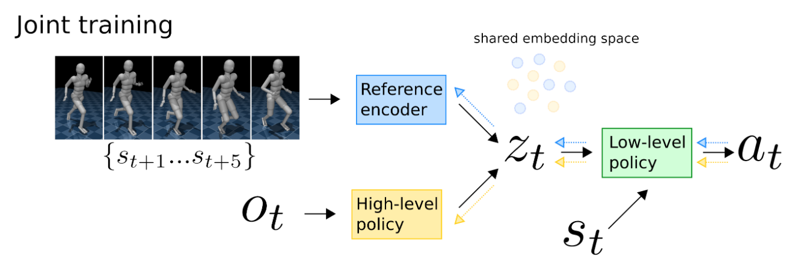

- [**PMLR**] Learning Locomotion Skills for Cassie: Iterative Design and Sim-to-Real. [[paper](http://proceedings.mlr.press/v100/xie20a/xie20a.pdf)]

#### Journal

[**IEEE-RAL**] Learning Natural Locomotion Behaviors for Humanoid Robots Using Human Bias. [[paper](https://ieeexplore.ieee.org/document/8990011)]

### 2019

#### Conference

- [**IROS**] Sim-to-Real Transfer for Biped Locomotion. [[paper](https://ieeexplore.ieee.org/abstract/document/8968053)]

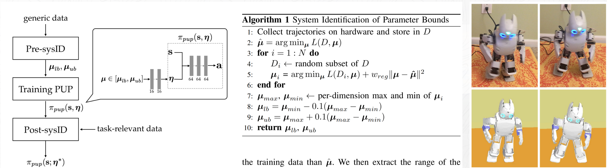

- [**ACM SIGGRAPH**] On Learning Symmetric Locomotion. [[paper](https://xbpeng.github.io/projects/SymLoco/2018_MIG_SymLoco.pdf)] [[code](https://github.com/UBCMOCCA/SymmetricRL)]

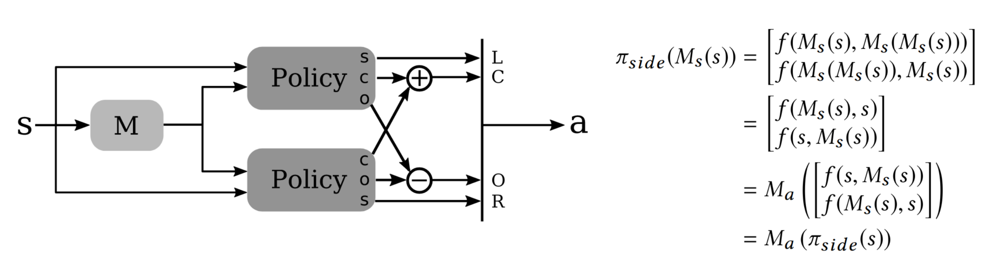

#### Journal

- [**Science Robotics**] Learning Agile and Dynamic Motor Skills for Legged Robots. [[paper](https://arxiv.org/pdf/1901.08652.pdf)] [[code](https://github.com/junja94/anymal_science_robotics_supplementary)]

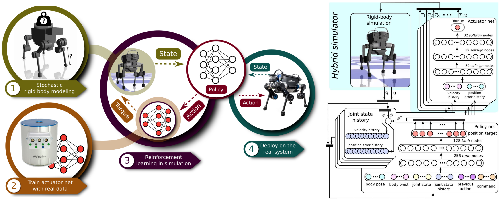

### 2018

#### Conference

- [**IROS**] Feedback Control For Cassie With Deep Reinforcement Learning. [**control**] [[paper](https://ieeexplore.ieee.org/abstract/document/8593722)] [[code](https://github.com/osudrl/cassie-mujoco-sim)] 

- [**ICRA**] Sim-to-Real Transfer of Robotic Control with Dynamics Randomization. [**sim2real**] [[paper](https://ieeexplore.ieee.org/abstract/document/8460528)] 

- [**RSS**] Sim-to-Real: Learning Agile Locomotion For Quadruped Robots. [**sim2real**] [[paper](http://www.roboticsproceedings.org/rss14/p10.pdf)]
- [**ACM SIGGRAPH**] DeepMimic: Example-Guided Deep Reinforcement Learning of Physics-Based Character Skills. [[paper](https://xbpeng.github.io/projects/DeepMimic/2018_TOG_DeepMimic.pdf)] [[code](https://github.com/xbpeng/DeepMimic)]

#### Journal

- [**ACM TOG**] Learning Symmetric and Low-Energy Locomotion. [[paper](https://dl.acm.org/doi/pdf/10.1145/3197517.3201397)]

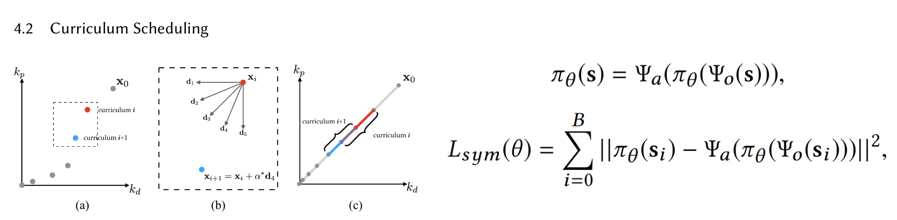

### 2017

#### Conference

- [**ACM SIGGRAPH**] Learning locomotion skills using deeprl: Does the choice of action space matter? [**control**] [[paper](https://xbpeng.github.io/projects/ActionSpace/index.html)] 

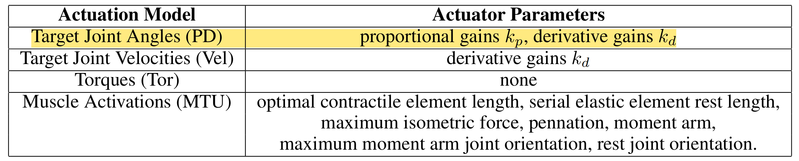

#### Journal
